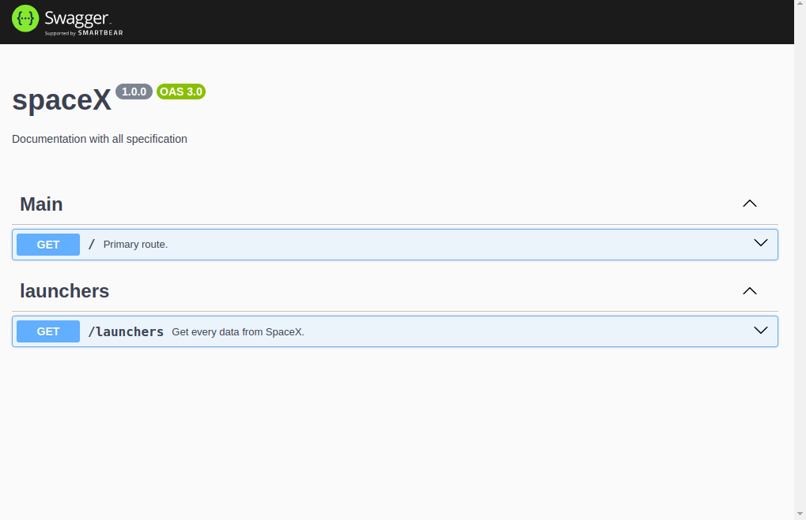

<h1 align="center">
  SpaceX API
</h1>

  
  
  
  

  <a href="#question-about">About</a>&nbsp;&nbsp;&nbsp;|&nbsp;&nbsp;&nbsp;
  <a href="#gear-technologies">Technologies</a>&nbsp;&nbsp;&nbsp;|&nbsp;&nbsp;&nbsp;
  <a href="#rocket-getting-started">Getting Started</a>&nbsp;&nbsp;&nbsp;|&nbsp;&nbsp;&nbsp;
  <a href="#clipboard-swagger-documentation">Swagger documentation</a>&nbsp;&nbsp;&nbsp;|&nbsp;&nbsp;&nbsp;
  <a href="#page_facing_up-license">License</a>&nbsp;&nbsp;&nbsp;

## :question: About

Space-Api is a back-end application made with NodeJS. 
This is a challenge that i have to consume data from the spaceX API and make some treatments in the data, for example pagination and stats.
I developed this app to apply the new things that I learned, like typescript and clean architecture. (This is my first project using clean architecture)

## :gear: Technologies

**These are the technologies that I used to develop this application:** 
⌨️ <strong>Typescript</strong> —> Extends JavaScript by adding types; 
⚙️ <strong>NodeJS</strong> —> A platform for building network applications; 
🌐 <strong>Express</strong> —> Web framework for Node.js 
📚 <strong>Mongo</strong> —> Database 
⚙️ <strong>Docker</strong> —> Devops 
📋 <strong>Swagger</strong> —> Documentation 

## :rocket: Getting Started

1. Clone this repo: `git clone https://github.com/AurelioMesquita/api-spacex`
2. Move to the directory: `cd api-spacex`
3. Install all dependencies `npm install`
4. Run `docker compose -f development/docker-compose.yml up`
5. The server runs on: http://localhost:3333

## :clipboard: Swagger Documentation

1. With the server running, access the url http://localhost:3333/docs
   

**This is a challenge by Coodesh**
